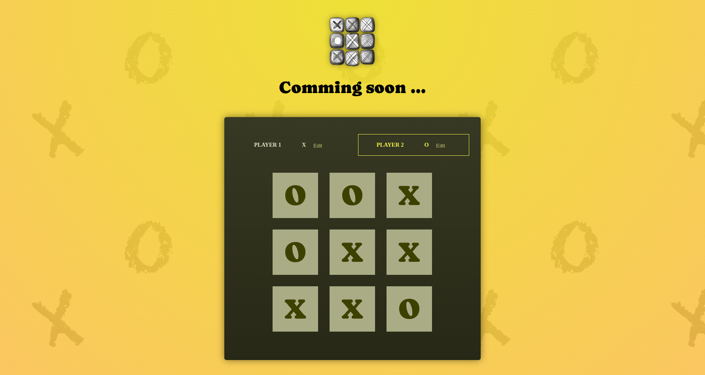

# 🎮 Tic-Tac-Toe in React.js

Welcome to the Tic-Tac-Toe game built with React! 🏆 This project is a simple yet interactive version of the classic game, allowing two players to compete in turns. Let's dive into how it works! 🚀

## 🙋🏼‍♀️ Live demo:

[](https://tic-tac-toe-react-omega-wine.vercel.app)

**Github repo:** [https://github.com/OllaWilk/Tic-tac-toe-react](https://github.com/OllaWilk/Tic-tac-toe-react)

## ✨ Features

    ✅  Player name editing 📝

    ✅ Turn-based game logic 🔄

    ✅ Dynamic game board 🎲

    ✅ State lifting for better control 📈

    ✅ Interactive UI with real-time updates

## 🦋 How It Works

1. App - The Main Component

👉 Manages game state and player turns

State gameTurns – Stores game history as an array of objects { square: { row, col }, player }.

State activePlayer – Keeps track of the current player (X or O).

Function handleSelectSquare(rowIndex, colIndex):

Switches the active player (X ⇄ O). 🔄

Saves each move to gameTurns, recording which player made a move and where.

Rendering:

Player component displays player names and allows editing. 📝

GameBoard renders the board and handles square selections. 🎲

Log (not yet implemented) will track move history. 📜

2. GameBoard - The Playing Grid

🚨 Current Issues in GameBoard 🚨

❌ Missing gameBoard state – The board should be either managed locally with useState or passed as a prop.
❌ Incorrect event handler – onselect is not defined. It should be onClick={() => onSelectSquare(rowIndex, colIndex)}.

How Should It Work?

The GameBoard should receive gameBoard as a prop or manage it locally.

Each button should correctly call onSelectSquare(rowIndex, colIndex) to update the board state.

3. Player - Player Component

🎮 Allows players to edit their names

State isEditing – Controls whether the player name is being edited. ✏️

State playerName – Stores the current name of the player.

Function handleEditClick – Toggles the editing mode (isEditing).

Function handleChange – Updates playerName based on user input.

Rendering:

If isEditing is true, renders an <input>; otherwise, a <span>.

The Edit button changes to Save while editing. 💾

The active class highlights the current player. 🌟

## 🦋 Installation project

**Clone the project:**

```
git clone https://github.com/OllaWilk/Tic-tac-toe-react.git
```

**Go to the project directory:**

```
cd Tic-tac-toe-react
```

**Install dependencies:**

```
npm install
```

**Start the server:**

```
npm start
```

## 🚀 Next Steps & Improvements

✅ Fix GameBoard implementation (pass state correctly and update buttons) 🔧

✅ Prevent overwriting a square that already has a symbol 🚫

✅ Implement game-ending logic (detecting a win or draw) 🏁

✅ Add a reset button to restart the game 🔄

🎉 Enjoy playing Tic-Tac-Toe!
